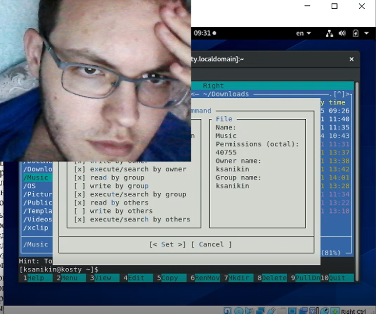
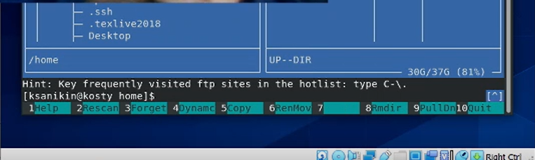
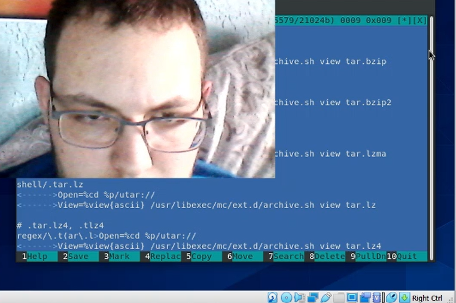

---
# Front matter
lang: ru-RU
title: Командная оболочка Midnight Commander
subtitle: ЛР по ОС 8
author: Аникин Константин Сергеевич
group: НПИбд-01-20

# Formatting
toc-title: "Содержание"
toc: true # Table of contents
toc_depth: 2
lof: true # List of figures
lot: true # List of tables
fontsize: 12pt
linestretch: 1.5
papersize: a4paper
documentclass: scrreprt
polyglossia-lang: russian
polyglossia-otherlangs: english
mainfont: PT Serif
romanfont: PT Serif
sansfont: PT Sans
monofont: PT Mono
mainfontoptions: Ligatures=TeX
romanfontoptions: Ligatures=TeX
sansfontoptions: Ligatures=TeX,Scale=MatchLowercase
monofontoptions: Scale=MatchLowercase
indent: true
pdf-engine: lualatex
header-includes:
  - \linepenalty=10 # the penalty added to the badness of each line within a paragraph (no associated penalty node) Increasing the value makes tex try to have fewer lines in the paragraph.
  - \interlinepenalty=0 # value of the penalty (node) added after each line of a paragraph.
  - \hyphenpenalty=50 # the penalty for line breaking at an automatically inserted hyphen
  - \exhyphenpenalty=50 # the penalty for line breaking at an explicit hyphen
  - \binoppenalty=700 # the penalty for breaking a line at a binary operator
  - \relpenalty=500 # the penalty for breaking a line at a relation
  - \clubpenalty=150 # extra penalty for breaking after first line of a paragraph
  - \widowpenalty=150 # extra penalty for breaking before last line of a paragraph
  - \displaywidowpenalty=50 # extra penalty for breaking before last line before a display math
  - \brokenpenalty=100 # extra penalty for page breaking after a hyphenated line
  - \predisplaypenalty=10000 # penalty for breaking before a display
  - \postdisplaypenalty=0 # penalty for breaking after a display
  - \floatingpenalty = 20000 # penalty for splitting an insertion (can only be split footnote in standard LaTeX)
  - \raggedbottom # or \flushbottom
  - \usepackage{float} # keep figures where there are in the text
  - \floatplacement{figure}{H} # keep figures where there are in the text
---

# Цель работы

- Освоение основных возможностей командной оболочки Midnight Commander.

- Приобретение навыков практической работы по просмотру каталогов и файлов; манипуляций с ними.

# Задание

- Ознакомиться с теоретическим материалом

- Выполнить оба задания работы

# Выполнение лабораторной работы

В ходе работы я неудачно расположил окно вирт машины относительно вебкамеры, из-за чего почти все скриншоты в работе будут маловидны.

Я буду давать пояснения, где это возможно.

## Работа с mc

1. Изучение информации об mc (рис. 1)

*Рис. 1: man mc*

2. Запуск mc (рис. 2)

*Рис. 2: Запущенный mc*

3.1 Копирование двух файлов (выделение на shift) (рис. 3.1)

*Рис. 3.1: Копирование двух файлов*

3.2 Информация о правах доступа (рис. 3.2)

*Рис. 3.2: Информация о правах доступа*

3.3 Информация о файле (рис. 3.3)

*Рис. 3.3: Информация о файле*

4.1 Перевод панели в режим информации (рис. 4.1)

*Рис. 4.1: Панель в режиме информации*

4.2 Перевод панели в режим дерева (рис. 4.2)

*Рис. 4.2: Панель в режиме дерева*

5.1 Просмотр текстового файла (рис. 5.1)

*Рис. 5.1: Текстовый файл*

5.2 Сохранение измененного текстового файла (рис. 5.2)

*Рис. 5.2: Здесь все прекрасно видно*

5.3 Поскольку здесь вообще ничего не видно, я покажу сначала процесс создания папки (рис. 5.31)

*Рис. 5.31: Создание папки*

и состояние родительского каталога после (файл размера 6 - созданная папка) (рис. 5.32)

*Рис. 5.32: Родительский каталог с папкой*

5.4 Аналогично. Процесс копирования файлов (рис. 5.41)

*Рис. 5.41: Копирование файлов*

и результат работы (размер папки увеличился с 6 до 36) (рис. 5.42)

*Рис. 5.42: Результат копирования файлов*

6.1 Поиск файла. Чтобы найти все файлы .md в папке ~/OS, нужно указать в верхней строчке ~/OS, а в Filename - *.md (рис. 6.11)

*Рис. 6.11: Поиск файлов*

Результаты поиска (рис. 6.12)

*Рис. 6.12: Результаты поиска*

6.2: С этим пунктом я не разобрался. Command history ничего не выводит

6.3: На камеру не попало совсем ничего, но план такой - переместить панель в режим дерева и выбрать домашний каталог

6.4: В файле расширений можно указать список команд, производимый при открытии файла того или другого расширения (рис. 6.41)

*Рис. 6.41: Файл расширений*

В файле меню можно указать список команд, производимых при нажатии пользователем клавиш контекстного меню (рис. 6.42)

*Рис. 6.42: Файл меню*

7. Работа с меню настроек. На камеру мои действия не попали. (рис. 7)

*Рис. 7: Одна из меню настроек mc*

## Работа с mcedit

К сожалению, при работе со второй частью ЛР, на камеру не попали вообще все манипуляции с текстом работы. Поэтому скриншоты лишь к работе с командной строкой и подсветкой синтаксиса.

1. Создание text.txt, открытие его mcedit-ом (рис. 21)

*Рис. 21: Создание text.txt*

4. Комбинации для заданий лабораторной:

Удаление строки текста - ctrl+y

Выделение - F3 два раза

Копирование - F5

Перемещение - F6

Сохранение - F2

Отмена - ctrl+u

Перейти в конец файла - End->Ctrl+End

Перейти в начало файла - Home->Ctrl+Home

Выйти - F10

5. Создание файла с расширением c (рис. 22)

*Рис. 22: Создание bla.c*

6. Включение подсветки синтаксиса (рис. 23)

*Рис. 23: Включение подсветки синтаксиса*

# Выводы

Несмотря на мой косяк при записи работы, работа сделана полностью, хотя и с некоторыми ошибками.