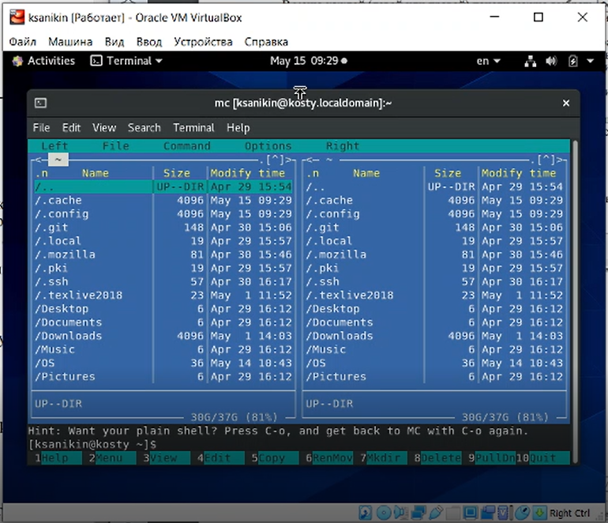
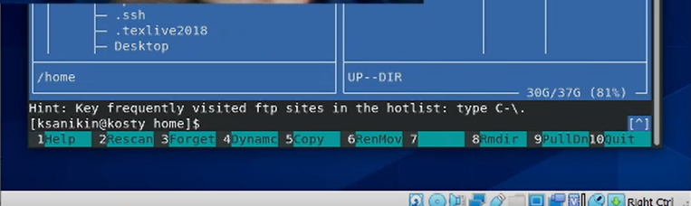
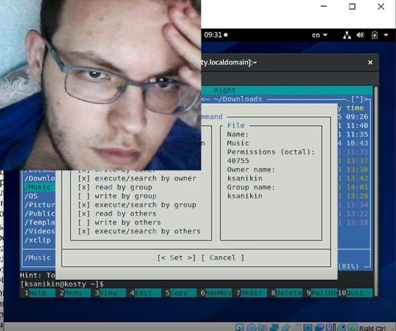
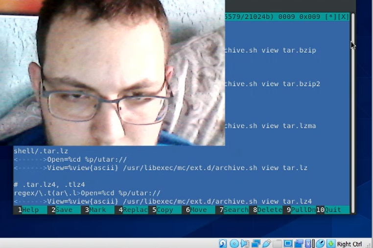
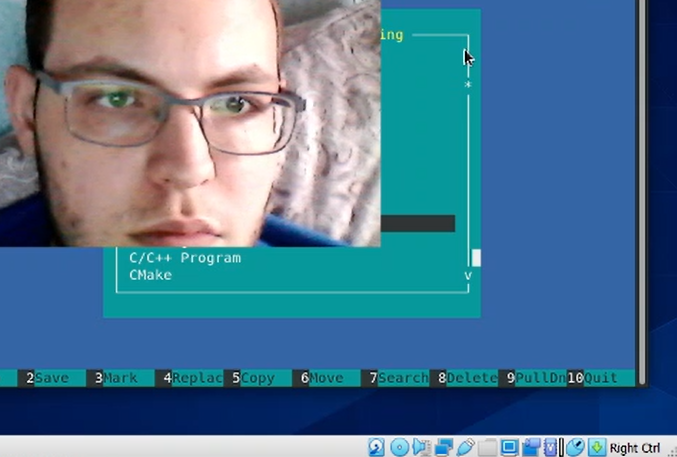

---
## Front matter
lang: ru-RU
title: Отчёт по ЛР№8 по ОС 
author: Аникин Константин Сергеевич
group: НПИбд-01-20

## Formatting
toc: false
slide_level: 2
theme: metropolis
header-includes: 
 - \metroset{progressbar=frametitle,sectionpage=progressbar,numbering=fraction}
 - '\makeatletter'
 - '\beamer@ignorenonframefalse'
 - '\makeatother'
aspectratio: 43
section-titles: true
---

# Цели

- Освоение основных возможностей командной оболочки Midnight Commander.

- Приобретение навыков практической работы по просмотру каталогов и файлов; манипуляций с ними.

---

# Задачи

- Ознакомиться с теоретическим материалом

- Выполнить оба задания работы

---

# Результаты 1

## Накладка с записью работы

## Запуск mc

---

# Результаты 2

## Работа с меню панелей

## Просмотр разрешений файла

---

# Результаты 3

## Чтение файла расширений

## Работа c mcedit

---

# Итоги

- Работа выполнена полностью, но с незначительными ошибками

- Неправильный скринкаст погубил скришоты

- Ещё 3 часа жизни были отданы на растерзание ОС